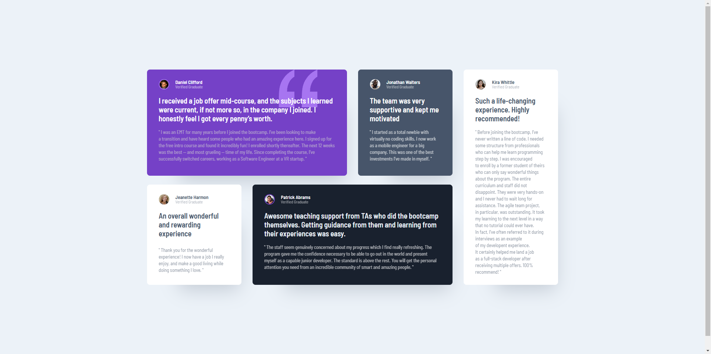

# Frontend Mentor - Testimonials Grid Section Solution

This is a solution to the [Testimonials Grid Section challenge on Frontend Mentor](https://www.frontendmentor.io/challenges/testimonials-grid-section-Nnw6J7Un7). Frontend Mentor challenges help you improve your coding skills by building realistic projects.

---

## Table of Contents

- [Overview](#overview)
  - [The Challenge](#the-challenge)
  - [Screenshot](#screenshot)
  - [Links](#links)
- [My Process](#my-process)
  - [Built With](#built-with)
  - [What I Learned](#what-i-learned)
  - [Continued Development](#continued-development)
  - [Useful Resources](#useful-resources)
- [Author](#author)
- [Acknowledgments](#acknowledgments)

---

## Overview

### The Challenge

The challenge was to build a **Testimonials Grid Section** using CSS Grid to create a responsive layout. The goal was to practice and enhance CSS Grid skills while maintaining a clean and visually appealing design.

### Screenshot

### Links

- [Live Site URL](http://fem-testimonials-grid-section-one.vercel.app/)
- [Solution URL](#)

---

## My Process

### Built With

- **Semantic HTML5**
- **CSS Grid**
- **Responsive Design**

### What I Learned

This project helped me:

1. Practice **CSS Grid layout** techniques to create a flexible and responsive grid.
2. Understand how to align and position elements dynamically using **grid-template-areas** and **grid-template-columns/rows**.
3. Identify areas where I still struggle to make designs **pixel-perfect**, which is an area I aim to improve in future projects.

### Continued Development

I want to focus on:

1. Improving my ability to achieve pixel-perfect designs.
2. Deepening my knowledge of advanced **CSS Grid** techniques.

### Useful Resources

- [CSS Grid Cheat Sheet by Malven](https://grid.malven.co/) - A handy guide to CSS Grid properties, which was incredibly helpful during the project.
- [MDN Web Docs](https://developer.mozilla.org/en-US/docs/Web/CSS/CSS_grid_layout) - A comprehensive resource for CSS Grid specifications.

---

## Author

- **Frontend Mentor**: [Profile](https://www.frontendmentor.io/profile/adambeckercodes)
- **GitHub**: [Profile](https://github.com/adambeckercodes)
- **Twitter**: [Profile](https://x.com/adambeckercodes)

---

## Acknowledgments

The **CSS Grid Cheat Sheet by Malven** was instrumental in helping me complete this project.